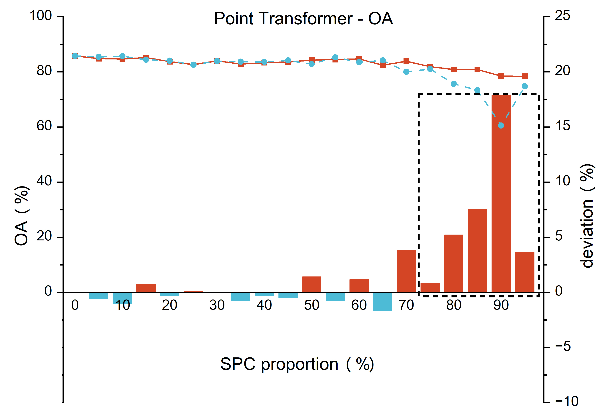

# Synthetic-Point-Clouds-for-semantic-segmentation
The results for the paper ["Impact of color and mixing proportion of synthetic point clouds on semantic segmentation"](https://doi.org/10.1016/j.autcon.2025.105963)

## Introduction
In the paper, we propose a method for generating synthetic point clouds (SPC) based on BIM models, and explore the 
impact of the mixing proportions (synthetic & real point clouds) on the training performance of semantic segmentation 
models. The impact of the mixing proportions between synthetic and real point clouds on the training of PointNet, 
PointNet++, and DGCNN models has been presented in the paper. At the same time, we are actively exploring the potential 
of SPC on more advanced semantic segmentation models or network architectures.  
The latest results will be continuously updated in this repository. 

## Results
### Statement  
#### Experiments Info
**SPC proportion**: the proportion of SPC to the total number of point clouds in the training 
set (proportion of scene quantity).  
**mixing training**: experiments of mixed training of synthetic and real point clouds with certain SPC proportions.  
**benchmark**: remove SPC from mixing training as benchmark experiments

#### Evaluation Metrics  
**mIoU**: mean Intersection over Union.  
**OA**: Overall Accuracy.  
**OA<sub>7</sub>**: overall accuracy not considering "clutter" class.

#### legend
<div align="center">
  
</div>

### PointNet (CVPR 2017) [[paper](https://web.stanford.edu/~rqi/pointnet/)]
<div style="text-align: center;">
  
  
  
</div>

### PointNet++ (NIPS 2017) [[paper](https://web.stanford.edu/~rqi/pointnet2/)]
<div style="text-align: center;">
  
  
  
</div>

### DGCNN (ACM TOG 2019) [[arXiv](https://arxiv.org/pdf/1801.07829)]
<div style="text-align: center;">
  
  
  
</div>

### Point Transformer (ICCV 2021) [[arXiv](https://arxiv.org/abs/2012.09164)]
<div style="text-align: center;">
  
  
  
</div>

## Citation
```@article{zsj26,
	author = {Shaojie Zhou and Jia-Rui Lin and Peng Pan and Yuandong Pan and Ioannis Brilakis},
	title = {Impact of color and mixing proportion of synthetic point clouds on semantic segmentation},
	journal = {Automation in Construction},
	volume = {171},
	pages = {105963},
	year = {2025},
	doi = {https://doi.org/10.1016/j.autcon.2025.105963},
}
```
